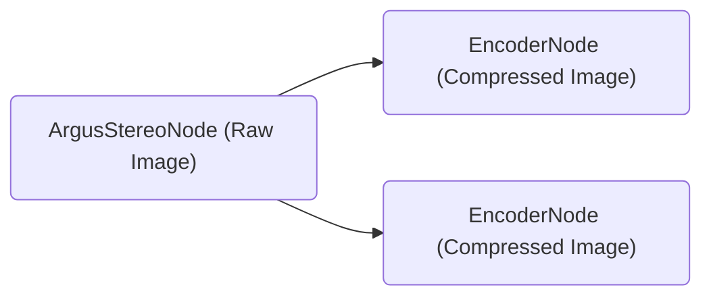

# Tutorial to Run NITROS-Accelerated Graph with Argus Camera



In this tutorial, we'll demonstrate how you can perform H.264 encoding using a [Argus-compatible camera](https://github.com/NVIDIA-ISAAC-ROS/isaac_ros_argus_camera) and [isaac_ros_h264_encoder](https://github.com/NVIDIA-ISAAC-ROS/isaac_ros_compression), and save the compressed images into a rosbag.

> Note: `isaac_ros_h264_encoder` needs to run on Jetson platform.

1. Follow the [Quickstart section](../README.md#quickstart) up to step 6 in the main README.

2. Outside the container, clone an additional repository required to run Argus-compatible camera under `~/workspaces/isaac_ros-dev/src`.

    ```bash
    cd ~/workspaces/isaac_ros-dev/src
    ```

    ```bash
    git clone https://github.com/NVIDIA-ISAAC-ROS/isaac_ros_argus_camera
    ```

3. Inside the container, build and source the workspace:

    ```bash
    cd /workspaces/isaac_ros-dev && \
      colcon build && \
      source install/setup.bash
    ```

4. (Optional) Run tests to verify complete and correct installation:

    ```bash
    colcon test --executor sequential
    ```

5. Run the launch file. This launch file will launch the example and record `CompressedImage` and `CameraInfo` topic data into a rosbag to your current folder.

   ```bash
   ros2 launch isaac_ros_h264_encoder isaac_ros_h264_encoder_argus.launch.py
   ```

6. (Optional) If you want to decode and visualize the images from the rosbag, you can place the recorded rosbag into an x86 machine equipped with NVIDIA GPU, then follow steps 7 & 8 in the [Quickstart section](../README.md#quickstart). (Change the rosbag path and input dimension accordingly in step 7):

    ```bash
    ros2 launch isaac_ros_h264_decoder isaac_ros_h264_decoder_rosbag.launch.py rosbag_path:=<"path to your rosbag folder">
    ```

    Here is a screenshot of the result example:
    <div align="center"></div>
